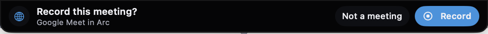
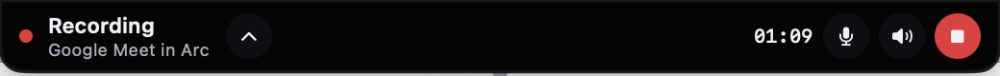
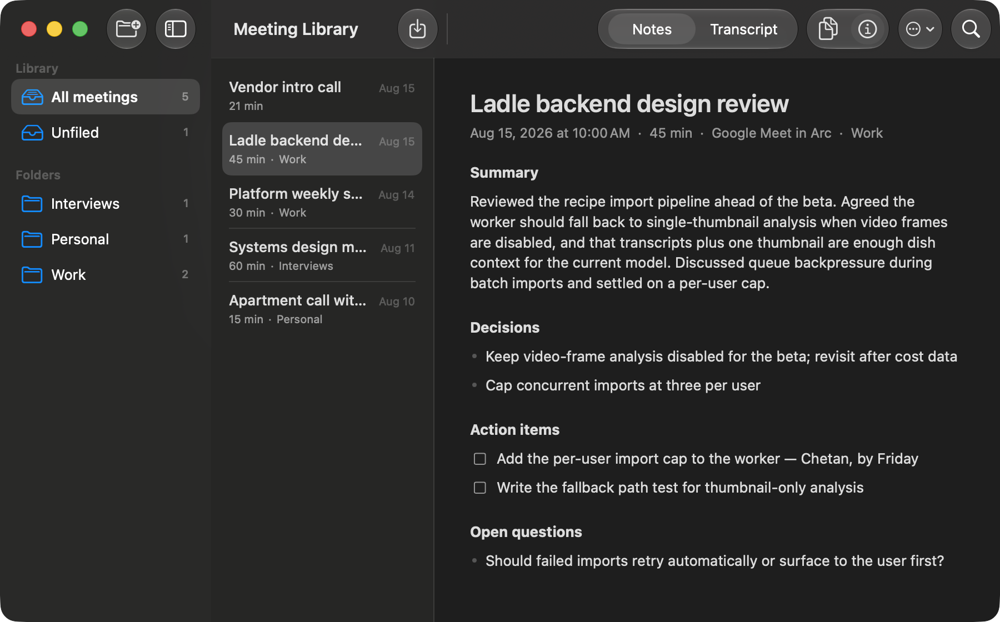

# Meeting Recorder

Meeting Recorder is a native macOS utility that detects meeting-client audio activity, records both sides of the call, and turns each meeting into an analyzed Markdown note: a speaker-attributed transcript plus an LLM-written summary, decisions, action items, and open questions, filed into folders. Its primary controls expand from the MacBook camera notch.

<p align="center">
  <br>
  <br>
  
</p>

The app icon uses the same visual language as the overlay: a light blue waveform wrapped around a coral recording dot on a warm, friendly background. The complete macOS icon set lives in the asset catalog.

There is no bot participant, hosted backend, or subscription. The app stores the OpenRouter key in Keychain and keeps meeting audio locally until transcription succeeds. Transcription and analysis both run through the user's own OpenRouter key.

## Download

Grab the latest signed and notarized DMG from [Releases](https://github.com/chetangoel01/meeting-recorder/releases), open it, and drag Meeting Recorder into Applications. If you launch it from the wrong place, the app offers to move itself.

First launch: enter an [OpenRouter](https://openrouter.ai) API key in Settings, grant Microphone and Screen & System Audio Recording access, and optionally grant Calendar access so meetings are named from your calendar. Transcribing a one-hour meeting costs a few cents; the analysis pass costs well under a cent.

## Current scope

- Detects Zoom, Microsoft Teams, Webex, and FaceTime native clients. Audio helper processes are folded into one stable client identity so a single call cannot queue duplicate prompts.
- Treats sustained, simultaneous microphone and output activity in any installed web browser as a possible web meeting. Browser helper processes are mapped back to their host app; the device-level fallback is limited to the frontmost browser while it is also producing audio.
- Optionally uses Google Meet, Zoom, Teams, Webex, and FaceTime calendar links as a backup prompt.
- Displays Record, Stop, processing, completion, and recovery states around the camera notch.
- Expands into narrow left and right wings around the physical notch instead of dropping a panel below it. Click the upward chevron during recording—or drag upward anywhere on the overlay—to tuck active controls away. Tucked mode keeps only the red recording light, microphone mute, and Stop; click the red light to restore the full controls. Processing states use a small handle.
- During recording, microphone and call-audio buttons independently include or exclude each source from the saved recording.
- Captures system audio and microphone samples directly through ScreenCaptureKit, then writes independent two-minute M4A recovery chunks instead of relying on ScreenCaptureKit's recording-output wrapper.
- Transcribes the microphone and call-audio tracks separately when both sides spoke, interleaving them into **Me** / **Them** blocks with timestamps at two-minute granularity. Near-silent chunks are dropped before upload so Whisper cannot hallucinate filler on them. Single-source recordings fall back to a plain combined transcript in eight-minute chunks.
- Runs an LLM analysis pass after every transcription (optional, on by default): a detailed narrative summary, key details, decisions, action items, and open questions, plus a short title and a suggested folder. The notes prompt is fully editable in Settings — change the sections, tone, language, or detail level; titling and folder routing keep working regardless. Analysis failures degrade to a plain transcript; they never lose one.
- Names meetings from the overlapping calendar event when Calendar access is granted, including attendees in the analysis context.
- Stores each meeting as two Markdown files: the note (frontmatter + analysis) and a linked `.transcript.md` sibling, in `~/Library/Application Support/Meeting Recorder/Transcripts` with one subdirectory per folder. The library viewer switches between Notes and Transcript tabs. Notes created by older versions load unchanged.
- Ships a Meeting Library window: folder sidebar, full-text search across titles, transcripts, and analysis, a tabbed note viewer, and context-menu filing (move between folders, create folders, trash). Meetings and folders can be renamed; deleting a folder moves its meetings to Unfiled instead of deleting them. While a recording or import is transcribing, it appears as a progress row at the top of the list, and the menu bar icon and menu reflect the pipeline state.
- Regenerates notes on demand: after editing the prompt or switching models, choose Regenerate Notes from the toolbar or a meeting's context menu to re-run analysis in place. Failed analyses render as an error card with the retry one click away — the title and folder you chose are never overwritten.
- Shows an info popover per meeting: recorded time, duration, source app, folder, calendar attendees, total OpenRouter cost, and Finder reveals for the note and kept audio.
- Imports existing meetings: an audio file (any common format) runs through transcription and analysis; a `.txt`/`.md` transcript skips straight to analysis. Import from the menu bar, the library toolbar, File -> Import Meeting (Cmd-O), or by dropping a file onto the library window.
- Keyboard-first library: Cmd-F focuses search, Cmd-1/Cmd-2 switch Notes/Transcript, and Delete moves the selected meeting to the Trash.
- Optionally copies every finished note into an Obsidian vault folder.
- Retains source audio after any recording or transcription failure.

## Requirements

- macOS 15 or later. The app is being developed and tested on macOS 27 Golden Gate beta.
- Xcode 26 or later.
- An OpenRouter API key with access to a speech-to-text model.

The default transcription model is `openai/whisper-large-v3` and the default analysis model is `deepseek/deepseek-v4-pro` (verified against OpenRouter's live model list; roughly $0.44/M input tokens, well under a cent per meeting). Both identifiers are editable in Settings; if OpenRouter renames a model, the failure surfaces in the note's analysis section and the fix is updating the Settings field.

## Build and run

1. Open `MeetingRecorder.xcodeproj` in Xcode.
2. Select the MeetingRecorder scheme and your Mac as the destination.
3. The project uses the owner's Apple Development team so macOS privacy grants persist across local updates. Choose your own Development Team under Signing & Capabilities if you build it on another account.
4. Build and run.
5. Enter your OpenRouter API key in Settings.
6. Grant Microphone and Screen & System Audio Recording access. Settings includes shortcuts to the matching macOS Privacy panes if a request was previously denied.
7. If calendar backup is enabled, grant Calendar access from the Reliability section.
8. Restart the app if macOS requests it after screen-recording permission is granted.
9. Keep Launch at login enabled so meeting detection is always running.

The notch prompt appears when a supported native client starts audio activity or when a browser has sustained microphone and output activity. Choose **Not a meeting** to suppress the prompt until that audio session ends.

For browser meetings, the app now waits for both microphone activity and sustained browser output. Calendar backup remains important for meetings that begin muted or before another participant speaks.

## Privacy and consent

The app never records automatically. A visible red recording light remains at the notch until recording stops, including in the tucked recording state. You are responsible for obtaining any consent required in your location and by the meeting participants.

Audio and transcripts stay on this Mac except for audio chunks sent to OpenRouter for transcription. Audio is deleted after a successful transcript unless **Keep audio after successful transcription** is enabled.

## Reliability behavior

- If recording succeeds but the API key is missing, the audio is retained and the notch offers Retry.
- If OpenRouter or the network fails, the audio is retained and can be retried.
- The notch does not enter Recording until both microphone and system-audio sample flow is verified. If either stream or the file writer stops during a meeting, recording stops with a visible error and keeps the completed audio chunks.
- Before transcription, the saved media duration is checked against the visible recording timer. A silent early cutoff is reported as a failure instead of being uploaded as if it were complete.
- New meeting detections replace old completion/error banners and are queued while saving or transcribing, so status UI cannot swallow the next meeting prompt.
- Calendar backup covers supported meeting links when a browser or native client has not yet opened its microphone. Calendar and audio detections for the same active call are coalesced instead of queuing a second prompt.
- Calendar monitoring resumes when access is granted in System Settings, and unsaved EventKit entries are deduplicated so they cannot re-prompt every polling interval.
- Manual recording is always available from the menu-bar item.
- Saved transcript duration comes from the finalized recording itself, excluding upload and transcription time.
- Turning the Mac's speaker volume down or using headphones does not remove call audio from the capture stream. Muting or pausing the meeting's incoming audio at its source does; use the speaker button in Meeting Recorder when you intentionally want to exclude call audio from the saved file.

## Development

The checked-in Xcode project is generated from `project.yml` with [XcodeGen](https://github.com/yonaskolb/XcodeGen). Regenerate it after changing targets or build settings:

```sh
xcodegen generate
```

Run the focused test suite with:

```sh
xcodebuild test -project MeetingRecorder.xcodeproj -scheme MeetingRecorder -destination 'platform=macOS'
```

## Releasing

Bump `CFBundleShortVersionString` in `MeetingRecorder/Resources/Info.plist`, commit, then run `./scripts/release.sh`. The script archives with Developer ID signing, notarizes and staples, builds the styled DMG, tags the version, and publishes a GitHub release with the DMG attached. Pass `--no-publish` to stop after the DMG. Requires the `meeting-recorder` notarytool keychain profile, `create-dmg`, and an authenticated `gh` CLI.

## Known limitations

- Browser detection requires simultaneous input and output, so a meeting that starts completely silent may rely on its calendar prompt or appear only when call audio begins.
- Recording includes all system audio playing on the selected display while capture is active. This avoids missing browser helper-process audio, but unrelated app sounds during the meeting can be included.
- The currently open two-minute recovery chunk still needs normal finalization. If the app or Mac crashes, earlier finalized chunks remain in the hidden capture work directory, but automatic crash-recovery UI is not yet implemented.
- Golden Gate is beta software. Audio-process behavior should be retested after each major beta update.

## License

[MIT](LICENSE)
